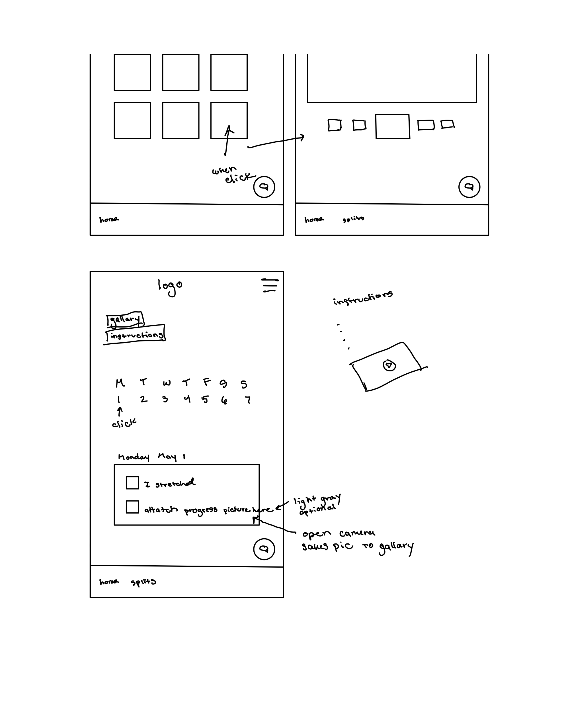
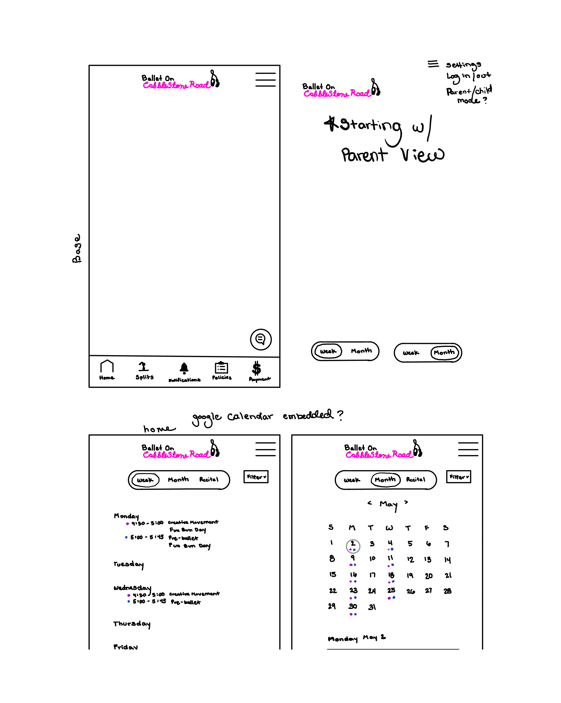
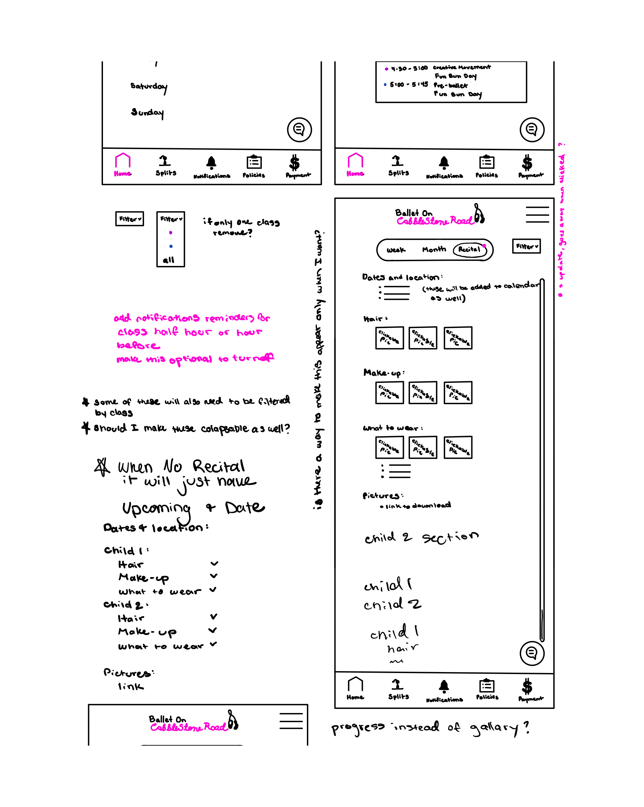
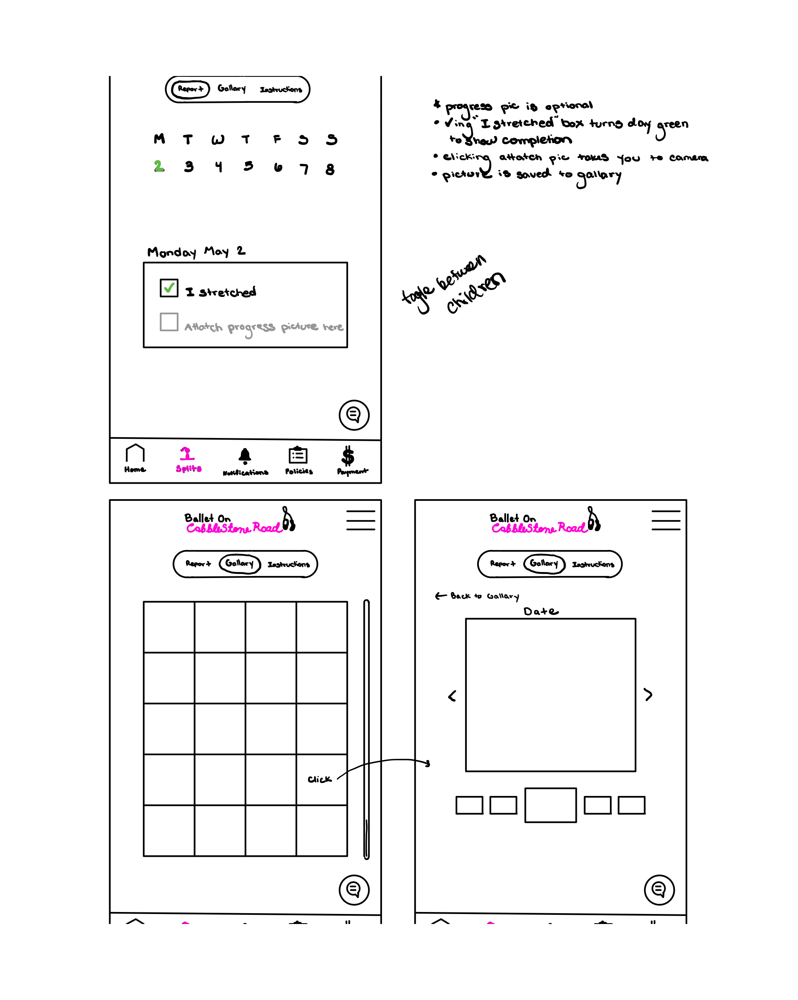
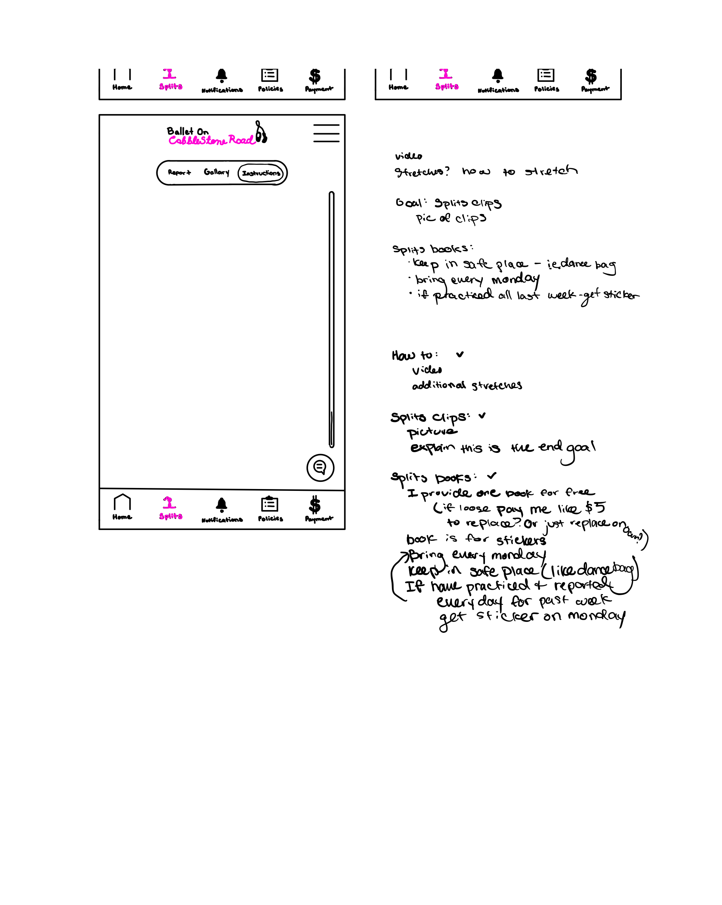
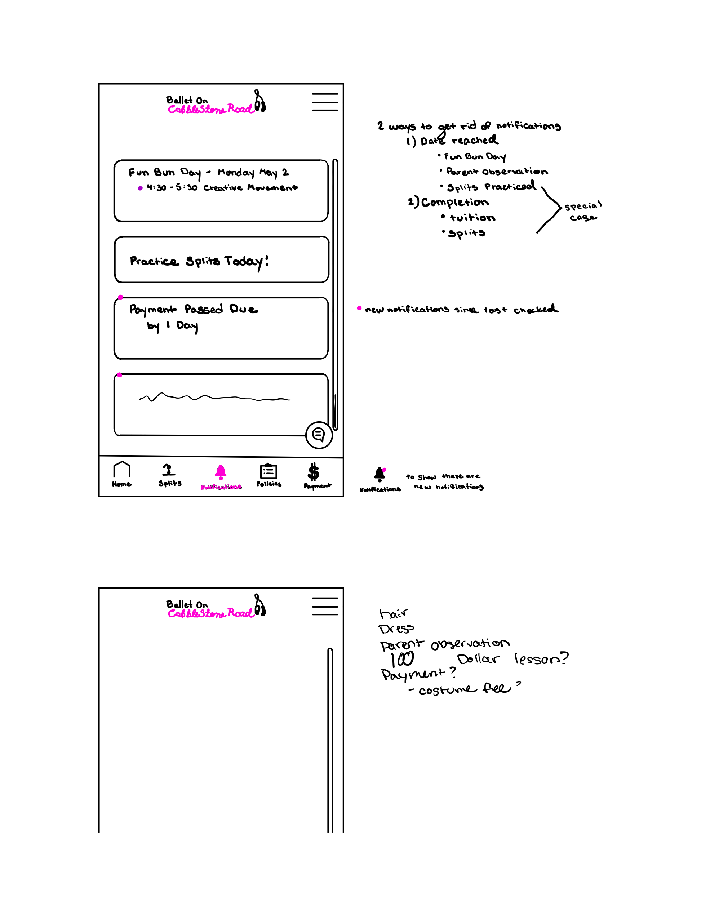
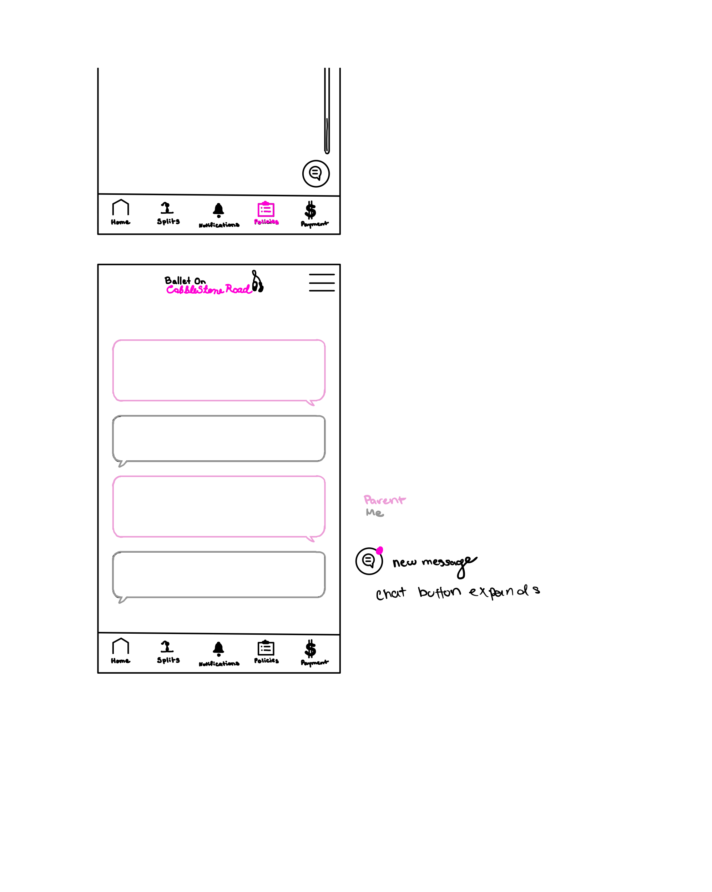
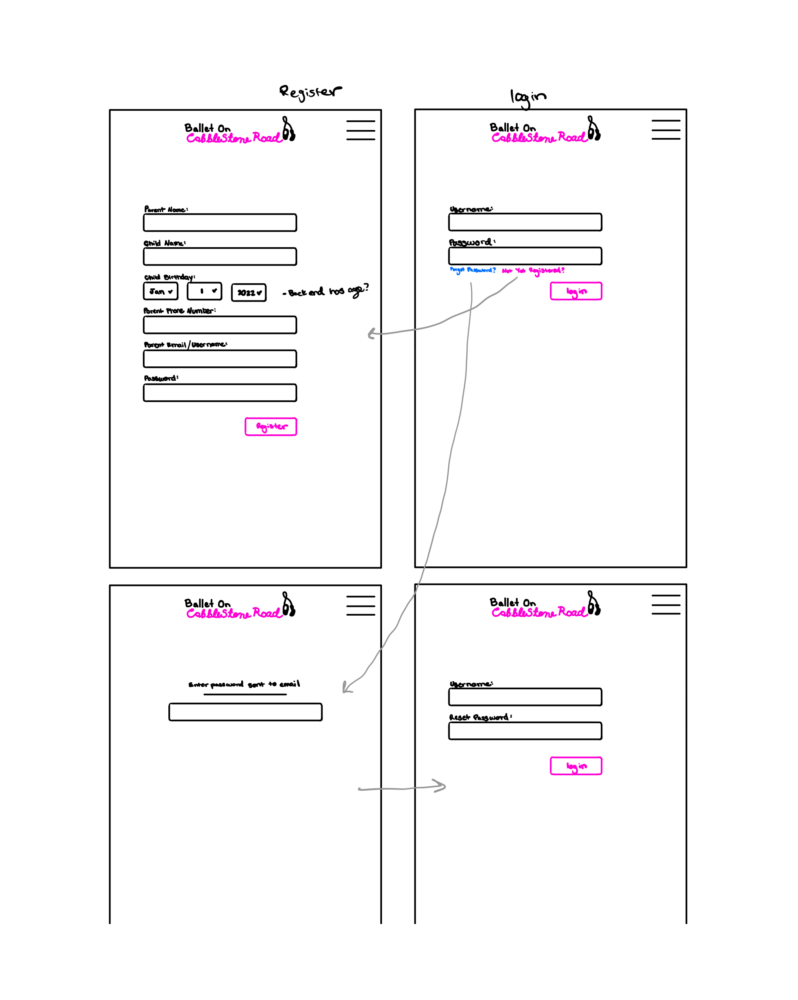
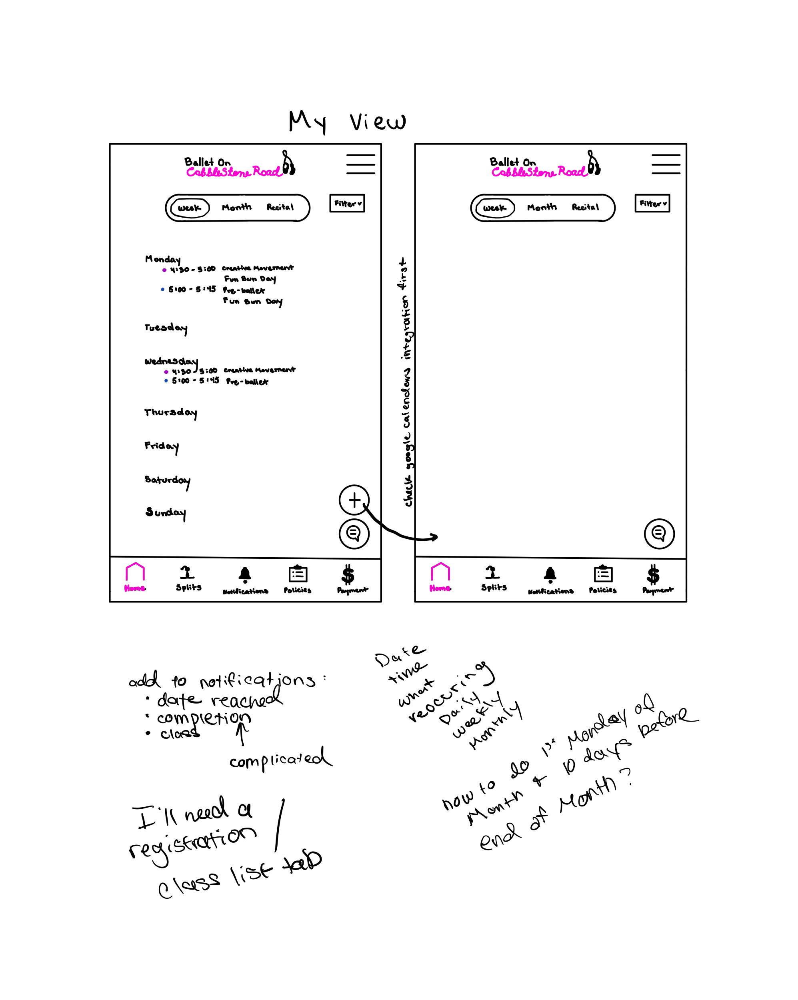

# Ballet On Cobblestone Road

## Elevator Pitch

I own and run my own ballet studio. I teach ages 3 to 14 currently. I love it so much. I love interacting with my students on a daily basis and seeing their progress and sharing their learning moments with them. However, communicating with the parents can be a hug problem for me. I have been unable to find a serice that provides all of the communication in one place. Currently I am using multiple platforms such as text, email, google calendars and google spreadsheets and frankly its a mess. I never know where I've put information or if I've forgotten to update something or if I've sent the right information to the right class's parents. So I have decided to just skip all the fuss and make my own app where I can easily put everything I need and update parents smoothly. Most moms these days are quite attatched to their phones and use them for reminders of their kids activities already, so I thought that would be the best way to communicate.

## Key Features

1. Log in and specific accounts for each parent.
2. Secure log in over HTTPS
3. On my end a clear list of classes, students and parents contact info.
4. On the parent end they will be able to see the class their student is enrolled in and what time the class is. (This will eventually turn into a calendar)
5. Both parents and myself will be able to update and edit their information.
6. There will be more but for this class I'm just going to focus on those 3.

## Technology Use:

**HTML** - I will start with 2 HTML pages: one for log in and one for the parents to view the class their child is enrolled in, the 3rd will be the page I see containing all the students info and their classes.

**CSS** - I want this app to look good on all phone and tablet sizes. I don't see this app ever being used for a bigger screen. But I want it to look clean and professional and very easy for moms to navigate and use.

**JavaScript** - Log in and register buttons work properly and the info page is able to be updated by either parents or me. When changes are made they will call the backend and send changes to the database.

**Web service** - Backend service for:

- adding a user
- retrieving user info
- retrieving lists of classes
- updating a users info

**DB/Login** - Stores users and their info in the database. Cannot log in unless they have already registered.

**WebSocket** - When a new user registers my list of students is updated. If I make changes to a classes schedule, it updates the parents account.

**React** - I'm going to use React so that the application can be used on both android and IOS.

## Mock Up of Key Pages in my App

## Startup HTML

- I ended up having to make more HTML pages than I thought I would. But I learned I really need to think things through and that everything (as in a clickable button) that will go to a new page of information needs an HTML.
- HTML's needed:

  - index.html (this is the login page)
  - registration.html
  - home.html
  - profile-information.html
  - edit-information.html
  - admin-dashboard.html (this will become my home page when I can actually code and store users)
  - student-info.html
  - notices.html
  - splits.html (these last two were just so I could figure out how to make a menue at the bottom work. I will not be adding anything else to these pages for this project, but I will in the future)

- Links:

  - I have linked all the appropriate pages to their buttons
  - index.html
    - login -> home.html
    - register -> registration.html
  - registration.html
    - register -> home.html
  - home.html
    - profile -> profile-information.html
  - profile-information.html
    - edit profile -> edit-information.html
  - edit-information.html
    - update information -> profile-information.html
  - admin-dashboard.html
    - any students name -> student-info.html
  - at the bottom of home.html, profile-information.html, admin-dashboard.html, student-info.html, notices.html, splits.html

    - home -> home.html
    - admin -> admin-dashboard.html
    - notices -> notices.html
    - splits -> splits.html

  - I have also added the chat. It will appear as one of the bottom menue buttons and can be accessed the same as all the others

- Images I plan to add in:

  - switch out the profile button for an avatar of the user and make it clickable
  - I will add my company logo to the top of all the pages where my name is locatd

- ~~3rd party API calls:~~ I got this wrong, this will just be my regular API calls to my own database:

  - this will be used when a user logs in or out, when a new user registers, and when pulling data to view on the home screen
  - this is (at the moment) what my app is all about, just adding to a database and viewing the information stored there

  - **3rd party API** will be a ballet quote of the day found on the notices tab

- WebSockets:

  - I was obviously very confused about the difference between API calls and WebSockets and I currently do not have an application for WebSockets in my app
  - So I will work on adding a chat of some kind (which I was going to add at some future stage) between me and the parents

  - chat has been added and prettiefied! (It's my favorite page so far)

## Startup CSS

- In starting the CSS, I realized I left out quite a few things (such as a log out button) and that my HTML was not structured the best to help me access the elements that I wanted. I ended up needing to add a bunch of class descriptions and rearagning most of my divs.
- But I was able to put the styling that was consistent accross the different pages into their own css file instead of having to copy and paste.
- Header, footer, and main content body
  - The header and footer I was able to style in one css file and I was able to add some fun functionality (I think) and my logo
- Navigation elements
  - all the links to different pages look quite professional (or at least as close to my vasa app as I could get)
  - none of them have funny underlines or weird colors
- Responsive to window resizing
  - this took me the longest to do, but I got the headers and the footers to work out first, then was able to work on the main body parts for each page
- Application elements
- Application text content
  - I got my husband to help me with both of these. I was able to have good spacing around all my elements and was even able to use google fonts to make everything consistent
- Application images

  - I was able to add my little avatar profile image and make it clickable
  - I also added my logo to the headers
  - and I even got cute little logos for the main buttons at the bottom in the footer

- WebSockets

  - As I only got my grade back for the HTML part of this assignment today, I have not had a chance to work on adding the WebSocket element
  - I will start on this tomorrow (it's 11:30 pm)

  - This has now been added in the form of a chat page. It is all prettiefied and looks wonderful (in my opinion)

## Startup JavaScript

- I made the app work for a single log in user, but also for someone registering for the first time.
- Login and Register
  - The information used to either log in or register is saved to local storage and is able to be accessed throughout the rest of the app
  - both take you to the home page where you can see "your childs" information
- Database
  - this is currently represented in multiple places.
  - the first is on the home page and profile pages
    - the information for the current user is "pulled" from the database and displayed using the html id's and classes
  - the second is on the admin page
    - class information is "pulled" from the database and displayed along with the various students enrolled in those classes
    - a student (currently named after the alphabet) can also be clicked on and have their personal information displayed (this is just the current users information, I didn't want to have to make too many people that I would have to go back and delete)
  - all databases are represented in local storage for now
  - I also replicated a 3rd party API call to pull my quote of the day on the notifications page. This will of course be updated later.
- WebSocket
  - this is the chat page
  - currently its just some fancy JavaScript to make the new message pop up under the already existing ones, but that will be updated
- Application logic
  - at the moment the only thing really changing is the users information which they can update and is stored in local storage to be used accross the app

## Startup Service

- I have added api back end calls for everything on my website: login and registration, user information, lists of students and a 3rd party api call for the quote of the day (I couldn't find an api for ballet quotes, so they are just quotes on being happy)
- Node.js/Express HTTP service - this is the index.js file in my main level
- static middleware for frontend - also in the index.js
- calls to 3rd party endpoints - this is the quote of the day found on the notices page
- backend service endpoints - I have created several mock databases in my service side index.js that are accessable throughout my app using api calls
- frontend calls service endpoints - this is used in all my fetch functions in all of my js files in public/js

## Startup Login

- Wow was this a whirlwind.

- MongoDB Atlas created - I have a users and a classes database
- Stores data in MongoDB - users are stored in the database and their information can be fetched, displayed and updated. Children are sorted into the appropriate classes in the classes database
- User registration - new users can register and they will be added to the users DB. The child will be sorted into the correct class and added to the classes DB.
- Existing user - the old users can login successfully and see all their information and even update it if needed.
- Use MongoDB to store credentials - basically same as above? I can store user information, their updates, and sort them into classes
- Restricts functionality - I have made an admin functionality so that the admin is the only one that can see all users information and the list of classes. A regular user can only see their own personal information

- Login: username: Jane, password: 123

  - this is just the basic one that I always used to log in real quick
  - if you'd rather, you can totally register a new user
  - access to the admin page will be restricted. If you click on it, it will just redirect you back to the home page. I wanted to remove the admin button, but that broke too many things for me to deal with at the moment.

- Admin login: username: Harley, password: 45738
  - login will take you right to the admin page
  - access to home is restricted and will just send you back to the admin page
  - if you registered a new user, you will be able to see the childs name pop up under their respective class and will be able to click on it to see their user information.

## Startup WebSocket

- Finally finished!! The WebSocket is used in the chat page. If you log in as a user, say Jane - username: Jane, password: 123 - on one computer and then as the admin Harley - username: Harley, password: 45738 - on another computer or your phone, you can talk back and forth with each other and the messages will showup automatically on the others screen.

- Backend listens for WebSocket connection - There are connections to the peerProxy in the server side index.js
- Frontend makes WebSocket connection - this is in the chat.js in the displayMessage function
- Data sent over WebSocket connection - The sendButton in the chat.js is what sends the info
- WebSocket data displayed - all messages can be seen from anyones chat page
